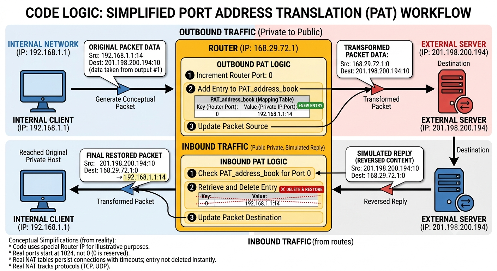

# Python PAT (Port Address Translation) Simulator

A lightweight Python conceptual model demonstrating how Port Address Translation (PAT), also known as NAT Overload, works on a network router. This project simulates the core logic of a router translating multiple private IP addresses to a single public IP address using port multiplexing. It generates mock outbound traffic, updates translation tables, simulates external server replies, and processes inbound return traffic.

# How it Works

1) **Packet Generation:** The script creates mock packets originating from random private IPs (192.168.1.x) destined for random public IPs.

2) **Outbound Translation:** As packets leave the "internal network", the router script:
    - Replaces the original private Source IP and Port with the Router's Public IP and an assigned Router Port.
    - Records this mapping in the PAT_address_book (State Table).

3) **External Reply Simulation:** The reverse_content() function mimics the external server sending a response back by swapping the Source and Destination headers.

4) **Inbound Translation:** When the reply reaches the router, it:
    - Looks up the destination port in the PAT_address_book.
    - Restores the original private IP and port so the packet can successfully reach the internal host.
    - Clears the port mapping from the table.



## Usage

This simulation is built as a Jupyter Notebook. To run it, open your terminal or command prompt and start Jupyter:

```bash
PAT_simulator.ipynb
